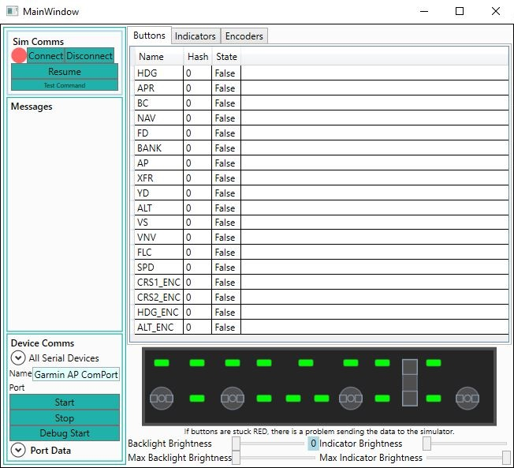

# Garmin Autopilot Interface

This app is the interface between the [Garmin AP Controller](https://github.com/Daxxn/GarminAPController/tree/main) and Microsoft Flight Simulators' SimConnect API.

The app handles connection with the sim and the controller, facilitates communication between the two, handles any conversions or event timings, and allows the user to configure settings for the controller.

As of right now, the app and controller are about 85% feature complete. the only features left are the settings management, AUX connector IO, and AUX serial logic.

Further details will be added as I go through the documentation/cleanup pass.